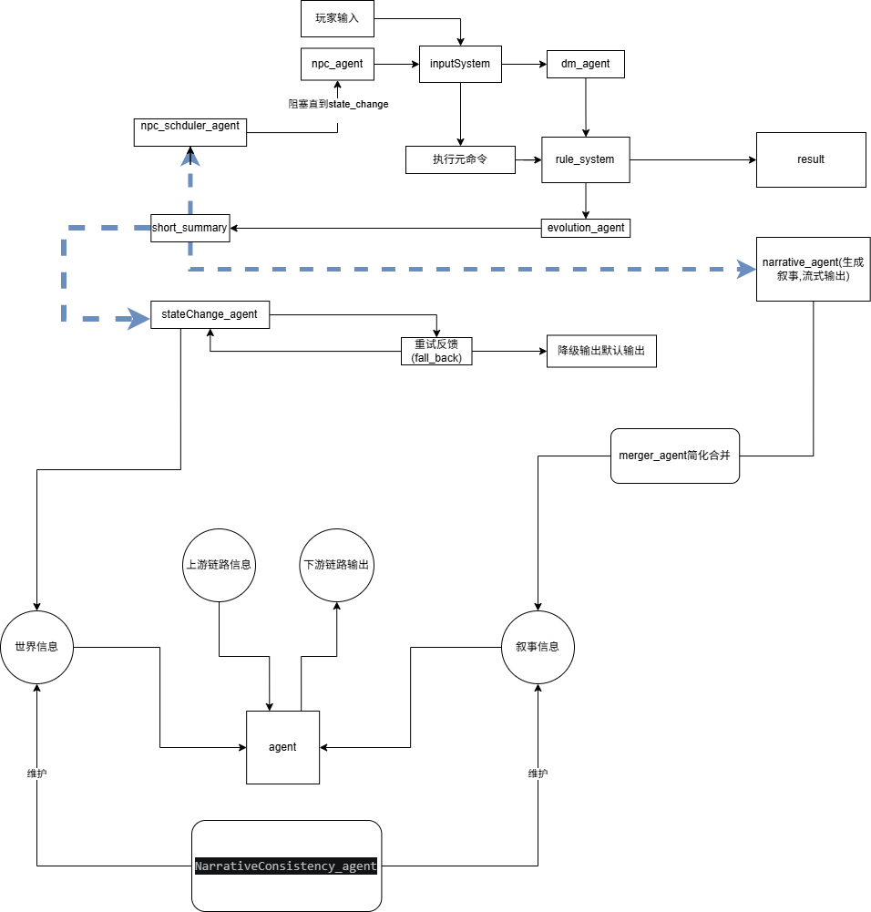

蓝色虚线是并发部分，完整介绍
# LLM驱动的文字冒险游戏
## 1. 目标与边界

本项目是一套面向文字冒险游戏的多 Agent 叙事引擎，目标是：

1. 同时支持玩家输入与 NPC 自主行为输入。
2. 支持元命令分支与自然语言分支的统一调度。
3. 采用“规则结算 + LLM 生成”的双驱动架构。
4. 将“世界真值”和“叙事真值”分离维护，避免叙事污染客观状态。
5. 提供可回滚、可重试、可持久化的状态更新机制。
6. 保持实现可落地，避免过度工程化。
7. 兼容各类输入,保障响应智能,玩家自由度高,实现线下跑团级的高代入自由体验
8. 可以实现多种属性类型配置,但其中 `敏捷`  属性作为优先级排序的前提是使用该框架进行游戏设计的必要前提需要显式提醒制作者设计敏捷属性,如果没有不允许进入系统

非目标：

- 暂不要求向量数据库落地实现，仅保留长期记忆扩展接口。
- 暂不支持多人在线并发写世界状态。
- 暂不支持跨存档的复杂分支合并。

## 2. 核心设计原则

1. **`location` 是位置真值**：人物与物品的位置只以 `location` 为准；地图上的 `char_index` / `item_index` 为系统派生索引，不允许 Agent 直接写入。
2. **链路对象必须结构化**：Agent 之间传递结构化对象，不直接把自由文本当作系统真值。
3. **每回合必须事务化**：每次输入都包裹为一个回合事务，携带 `turn_id`、`world_version`、`event_id` 等元数据。
4. **叙事链路统一进 e7**：`evolution_agent.summary` 无论是否可见都必须写入回合因果链（e7），并由 `merger_agent` 统一合并。
5. **真值池分层维护**：世界状态、叙事状态、链路日志分别维护，不允许混写。
6. **扩展字段必须受约束**：所有 `extensions` 字段都必须挂载在命名空间下，并由 schema registry 约束读写权限。

## 1. 回合事务与并发控制

### 1.1 回合事务字段

每次输入都使用代码系统为其增加事务字段如下：

```ts
TurnEnvelope {
  raw_input:str 
  turn: int 回合数
  trace_id 链路追踪id
  debug debug信息
}
```

### 1.2 并发范围

V1 只允许以下一个并发区：

1. `ShortSummary` 完成后，并发生成：
   - `NpcPlan` npc_schduler的输出
   - `StatePatch` state_change_agent的输出
  - `NarrativeText` narrative_agent 的字符串输出（仅 visible_to_player=true 时生成）

除此之外：

- 世界真值写入必须串行。
- 一个时刻仅允许一个 `StatePatch` 进入提交临界区。
- `npc_agent` 必须等待当前回合的状态提交完成后再继续动作。

### 1.3 锁与快照策略

1. 读取世界状态时使用只读快照，不阻塞其他读取。
2. 提交 `StatePatch` 时使用单个 `asyncio.Lock` 保护提交临界区。
3. 所有并发分支都必须带上自己的 `turn_id` ，禁止消费无版本信息的对象。


，`StatePatch` 必须带以下字段：

```ts
PatchMeta {
  trace_id: int;
  turn_id: int;
  retry_seq: number;
}
```

---

## 实体 ID 系统规范
    解决原设计中 ID 命名不严谨、实体冲突、管理困难的问题，统一全引擎实体唯一标识标准
1.  固定命名格式
plaintext
[实体类型]-[有意义名称]-[唯一后缀]
2. 字段定义与约束
表格
字段	可选值 / 约束	说明	示例
实体类型	固定枚举：map/char/item	严格区分实体类型，禁止自定义	map-bedroom、char-innkeeper、item-roomkey
有意义名称	小写英文、下划线分隔，禁止特殊字符	见名知意，对应实体核心含义	禁止使用无意义随机字符串
唯一后缀	4 位递增数字，全局唯一	保证 ID 全局唯一性，避免重名冲突	map-bedroom-0000
3. 补充规则
    玩家实体固定 ID：char-player-0000，全局唯一
    所有实体 ID 必须在创建时完成全局唯一性校验，重复 ID 禁止入库
    实体 ID 创建后永久不可修改，实体删除后 ID 归档，禁止复用
    所有引擎模块必须通过 ID 索引实体，禁止通过名称 / 描述索引

---

## 5. 条件 DSL 规范

### 5.1 用途

条件 DSL 当前用于：

1. 结局判定
2. 地图连接或交互条件判定
3. `ASSERT` 前置断言

### 5.2 语法

```text
[实体ID].[字段路径] [操作符] [值]
```

### 5.3 支持操作符

| 操作符 | 说明 |
|--------|------|
| `==` | 等于 |
| `!=` | 不等于 |
| `>` | 大于 |
| `<` | 小于 |
| `>=` | 大于等于 |
| `<=` | 小于等于 |
| `in` | 在列表中 |
| `not in` | 不在列表中 |

### 5.4 复合条件

支持使用 `and`、`or`、`not` 组合多个条件。

### 5.5 示例

```text
char-player-0000.attributes.health.value > 0 and item-room_key-0008.location in [char-player-0000, map-cellar-0001]
```

### 5.6 执行约束

1. 条件求值必须基于同一版本的世界快照。
2. `ASSERT` 与结局判定共享同一解析器。
3. 不允许在条件 DSL 中执行写操作。
4. 不允许引用未注册字段路径。


## 系统运行流程:

```

系统总览

这是一套带输入分支路由、LLM与规则双驱动、带状态回滚容错的交互式多智能体游戏叙事系统，核心逻辑为：inputSystem负责输入类型分流，底层元命令跳过LLM链直接走规则引擎，自然语言输入进入LLM导演链；蓝色虚线代表并发执行的独立分支流程，同时内置「重试-降级-回滚」的完整容错机制。


---
一、输入分流与核心主链路（核心修正点）

1. 输入入口与分流逻辑

玩家输入 + npc_agent（NPC行为代理）的NPC自主行为输入，其中玩家输入进入inputSystem（输入系统）,由其完成输入类型判定与分支路由,npc输入进入ruleSystem，：

- 分支A：底层元命令（如\look等指令）：直接跳过所有LLM调用链，仅将元命令传递给rule_system（规则系统），由rule_system直接生成元命令执行结果（result），该分支流程直接结束

- 分支B：自然语言描述输入：不直接进入rule_system，而是交给dm_agent（导演代理），进入完整LLM调用链

2. LLM调用链（自然语言输入专属）

dm_agent对自然语言输入做意图解析、语义理解、叙事合理性校验后，将结构化后的输入传递给rule_system，由rule_system完成游戏规则判定、逻辑校验，生成最终执行结果

- rule_system的结果一方面输出result（自然语言输入的执行结果），另一方面驱动evolution_agent（世界演化代理），执行世界状态变更的计算逻辑

3. NPC阻塞机制

npc_agent会被阻塞直到state_change（世界状态变更完成，含重试/回滚全流程结束），才会生成下一轮NPC行为输入，保证NPC行为始终基于最新、有效的世界状态


---
二、蓝色虚线标注的并发执行分支

evolution_agent完成世界演化计算后，生成short_summary（本次交互的短摘要，包含完整状态变更信息）,同时并发触发独立任务（蓝色虚线）：


1. 并发分支A：发送给npc_scheduler_agent（NPC调度代理），用于规划后续NPC的自主行为

2. 并发分支B：发送给stateChange_agent（状态变更代理），驱动全局世界状态的正式更新

3. 并发分支2：当 `visible_to_player=true` 时发送给narrative_agent（叙事代理），由其生成自然语言叙事字符串并进行流式输出


---
三、状态变更与容错机制（完全按你的需求修正）

stateChange_agent接收short_summary的状态变更指令，执行世界状态更新操作，容错逻辑如下：

1. 若状态变更失败，触发持续重试反馈（fall_back）：stateChange_agent会进行多次自动重试

2. 若多次重试仍失败：

  - ① 触发降级逻辑：输出默认兜底输出，保证用户体验不中断

  - ② 执行状态回滚：将世界状态完全恢复到本次输入执行前的状态，避免脏数据

3. 重试成功/降级回滚完成后，将最终有效状态同步到「世界信息」全局状态池


---
四、叙事后处理与NPC行为闭环

1. 叙事后处理：`evolution.summary`（始终存在）与 narrative_agent 的可见叙事字符串（可选）统一进入merger_agent（合并代理），完成简化、去重、逻辑合并，再同步到「叙事信息」全局状态池

2. NPC行为闭环：npc_scheduler_agent基于short_summary的状态信息，生成NPC行为调度指令，驱动npc_agent生成新的NPC行为输入，形成NPC自主行为的完整闭环


---
五、全局一致性保障与底层支撑

1. 双状态池架构：系统维护两个核心全局状态，由专门代理保障一致性：

  - 「世界信息」：存储所有实体、场景、属性等客观世界状态，由stateChange_agent同步更新

  - 「叙事信息」：存储所有已发生的叙事事件、对话、因果关系等主观叙事状态，由merger_agent同步更新

2. 一致性核心：NarrativeConsistency_agent（叙事一致性代理）同时维护、校验两个状态池，保障世界状态与叙事逻辑的全局自洽，避免出现逻辑矛盾

3. 通用代理支撑：基础agent模块从「世界信息」获取全局状态，接收上游链路信息、产生下游链路输出，为所有上层代理提供通用能力支撑


```
## 数据模型
### 世界模型:

#### 描述系统(description):
    - public-List[str] :一个可以只可以被系统层代码写入的字段,记录实体的默认可见信息
    - hint-str :一个提供给agent的信息,用于引导玩家,只读
    - add-List[Dict[Timetable,str]] :用来暂存实体信息变化的字段，每10个回合激活一致性agent维护并清空，将当前情况写入public

#### 记忆系统(Memory角色专有):
     Memory {
  // 完整对话/行为日志，仅用于debug与回溯，不进入LLM上下文
  log: List[
    LOG{
    turn: number;
    content: string;
    timestamp: number;
    }
  ];
  // 向量数据库存储的长期记忆，用于关键事实检索,暂时不做,保留接口
  longTermMemory: {
    vectorId: string;
    // 记忆关键摘要
    summary: string;
    // 发生背景
    turn: string;
  }[];
  // 调度器提供的本回合额外信息,提供给NPC判断,新的被压入时,旧的被压入到short当中
  currentEvent: string;
  // 短期叙事记忆，默认保留最近15回合,多余加入短期日志当中
  short: string[];
  // 短期日志，提供给一致性系统使用，默认保留最近30回合
  shortLog: Array<{
    turn: number;
    event: string;
  }>;
  // 关键事实库，由一致性系统从shortLog中提取维护,包含删除或增加两种操作，供给给LLM的核心上下文
  keyFacts: string[];
}
#### 目标模型(Goal):由npc自行维护
    - baseGoal:基本目标,开始时由设定提供,可被npc自动写入
    - activeGoal:当前计划,可被npc自动写入
    - goalHistory:目标历史,每当npc,写入新的Goal时加入被覆盖的Goal,仅向NPC展示前3GOAL
    

#### 地图信息:
    - id-[str]:地图id
    - name:名称
    - description:描述系统
    - parent-Dict[id,name]:父级区域
    - child-List[Dict[id,name]]:子级区域 
    -  connection-List[
        Connction{
            - id,
            - name(str),
            - direction,
            - descrption,
            - isLocked,
            - condition
        }
    ]
    - charDist-Dict[id,name(str)]:哪些人物在
    - itmeDist-Dict[id,name(str)]:哪些物品在
    - extra:?

#### 物品信息:
    - id
    - name
    - description
    - location
    - is_protable
    - extra:?

#### 人物信息:
    - id 
    - name
    - basic_info
    - location
    - status [Status]:人物状态
    - aribute [Attributes]  :属性信息
    - Memory [Memory]
    - Goal [Goal]
    - extra:?
### Attrubutes/Status(支持自定义属性与状态):
Attribute {
  id: string;
  name: string;
  value: number;
  maxValue: number; //不会提供给agent,仅用于系统
  minValue: number; //同上
  // 属性描述，用于Agent理解
  description: string;
}

// 状态：角色,血量,san值等
 Status {
  id: string;
  name: string;
  value: number;
  maxValue: number; //不会提供给agent,仅用于系统
  minValue: number; //同上
  // 属性描述，用于Agent理解
  description: string;
}

### 上下文信息模型:
    E1:世界信息
      - 描述层
        - 切片(不完整)
        - 视图(完整)
      - 数值层
        -仅state_agent消费
    E2:叙事信息
        - recent(最近5回合,多的被压入到narrative当中)
        - NarrativeLog(记录用以debug)
    E3:链路信息
        e1:输入信息:输入系统的原始信息
        e2:意图诠释:系统对该原始信息的理解,由dm_agent产生，帮助信息路由到不同地方
        e3:规则结算事实:系统的客观判断,由rulesystem产生
        e4:步骤结算:系统的推演结算,由evolution_agent,scheduler产生
        e7:回合因果链:每个链路信息的时序关系,记录步骤结算e4,包含时间戳
    E4:叙事投影: 结算出的新叙事信息,由narrative_agent产生可见叙事字符串（可选）,并与e7一起交给merger_agent合并成简短记录,作为叙事真值,写入到叙事信息中的recent当中
    E5:世界投影: 结算出的新世界信息,由state_change_agent产生,并直接写入到持久化数据库中


### agent模型:
    - id: 名称
    - skill: 初始提示词,包含其要做什么
    - 链路输入
          -  dmagent
              - e1
         -   evolution
                -  e1
                -  e3
                -  e7
         -  state
               -  e4
               - fallbackerror
        -   npcscheduler
               -  e4
        -  npcperformer
               -  e4来自scheduler提供的npc在本回合内需要知晓的额外信息
               -  e1
       -  narrative
               - e4来自evolution
       - merger_agent:
                - e7
    - 世界信息
        -   描述层
            - dm
                - 视图
            - evolution
                - 视图
            - state
                - 视图
            - npcschduler
                - 切片
            - narrative&merger
                - 切片
            - npc&玩家
                - 切片
        - 数值层
            - state

    - 叙事信息(NarrativeLog)
        -  dm
        - evolution
        -  npcschduler
        - narrative
    
    - agent_memory
         -  dm
             -  对话信息(最近5回合,多余压入Log)
             -  dilogueLog
          -  npc
              -  Memory

## 2. 状态写入 DSL 规范

### 2.1 可写字段边界

`state_change_agent` 只允许生成作用于 `WorldState` 的补丁，不直接写叙事池和派生索引。

| 字段类别 | 是否允许直接写入 | 说明 |
|----------|------------------|------|
| `location` | 是 | 位置唯一真值 |
| `attributes.*` / `status.*` | 是 | 数值或枚举状态 |
| `description.add` | 是 | 描述增量缓冲 |
| `connections[*].is_locked` | 是 | 地图连接锁状态 |
| schema registry 中声明为 `mutable` 的 `extensions.*` | 是 | 扩展字段 |
| `description.public` | 否 | 由系统合并流程维护 |
| `char_index` / `item_index` | 否 | 由 `location` 自动派生 |
| `memory.log` / `narrative_state.*` | 否 | 分属其他系统 |

### 2.2 基础操作符

V1 支持以下操作符：

| 操作符 | 用途 | 适用类型 |
|--------|------|----------|
| `ADD` | 向列表字段追加元素 | list |
| `REMOVE` | 从列表字段移除元素 | list |
| `SET` | 直接设置字段值 | string / bool / enum / object |
| `UPDATE` | 更新数值字段 | number |
| `MOVE` | 变更 `location` | 唯一真值字段 |
| `ASSERT` | 提交前断言 | 条件表达式 |

### 2.3 语法

```text
ASSERT [条件表达式]
ADD [实体ID].[字段路径] = [值1, 值2, ...]
REMOVE [实体ID].[字段路径] = [值1, 值2, ...]
SET [实体ID].[字段路径] = [新值]
UPDATE [实体ID].[字段路径] = [新值]
MOVE [实体ID].location = [目标实体ID]
```

### 2.4 示例

```text
ASSERT map-cellar-0001.connections[0].is_locked == false
UPDATE char-player-0000.attributes.health.value = 80
MOVE item-room_key-0008.location = char-player-0000
ADD map-cellar-0001.description.add = [{turn: 12, content: "地板上多了被拖拽的痕迹"}]
REMOVE char-bandit-0002.extensions.combat.tags = ["hidden"]
SET map-cellar-0001.connections[0].is_locked = true
```

### 2.5 执行顺序

单个 `StatePatch` 的执行顺序固定为：

1. 解析补丁
2. 执行全部 `ASSERT`
3. 执行 `MOVE`
4. 执行 `SET` / `UPDATE`
5. 执行 `ADD` / `REMOVE`
6. 重新计算派生索引
7. 持久化提交

### 2.6 校验流程

持久化层收到 `StatePatch` 后，按顺序校验：


1. 实体 ID 是否存在
2. 字段路径是否存在且可写
3. 字段类型与操作符以及写入值是否匹配
4. 数值是否越界
5. move的值如`location` 的目标是否有效

若任一检查失败，返回错误并拒绝提交。

### 2.7 错误类型定义

| 错误类型 | 说明 |
|---------|------|
| `ENTITY_NOT_FOUND` | 实体不存在 |
| `FIELD_NOT_FOUND` | 字段不存在 |
| `FIELD_NOT_MUTABLE` | 字段不可写 |
| `FIELD_TYPE_MISMATCH` | 字段类型不匹配 |
| `VALUE_OUT_OF_RANGE` | 数值超界 |
| `DUPLICATE_ENTRY` | 列表追加重复元素 |
| `ENTRY_NOT_FOUND` | 列表删除目标不存在 |
| `INVALID_TARGET` | `MOVE` 目标无效 |


### 2.8 重试、降级与回滚

1. 单次提交失败时，允许自动重试。
2. 单次重试超时后，标记本次尝试失败。
3. 超过最大重试次数、发生超时或出现不可恢复错误时，进入回滚流程。
4. 回滚必须恢复到本回合开始前的快照版本。
5. 回滚完成后：
   - 此次丢弃 `Narrative_agent`生成结果
   - 不写入正式叙事池
   - 输出系统降级提示
   - 终止当前交互，等待玩家重新输入
6. 错误日志需记录：`turn_id`、`patch_id`、错误类型、错误消息、重试次数、时间戳。

## 5. 配置管理规范

### 5.1 配置来源优先级

命令行参数 > 环境变量 > 配置文件 > 默认值

### 5.2 配置文件格式（YAML）

```yaml
# config.yaml

# LLM 配置
llm:
  model: "gpt-4"                    # 模型名称
  temperature: 0.7                  # 生成温度
  max_tokens: 2000                  # 最大token数
  timeout: 30                      # 超时时间（秒）
  api_base: "https://api.openai.com/v1"  # API地址

# 系统配置
system:
  max_retry_count: 3                # 状态变更最大重试次数
  retry_timeout_ms: 5000            # 重试超时（毫秒）
  fallback_error: "系统繁忙，请稍后重试"
  snapshot_interval: 10             # 快照保存间隔（回合数）

# Agent 配置
agent:
  dm:
    memory_turns: 5                 # 对话记忆保留回合数
  npc:
    memory_turns: 15                # NPC短期记忆保留回合数
    shortlog_turns: 30              # NPC日志保留回合数
  narrative:
    recent_turns: 5                 # 叙事最近保留回合数
```

### 5.3 魔法数字配置项

| 配置项 | 默认值 | 说明 |
|-------|-------|------|
| `system.max_retry_count` | 3 | 重试次数 |
| `system.retry_timeout_ms` | 5000 | 超时毫秒 |
| `agent.npc.memory_turns` | 15 | NPC短期记忆回合数 |
| `agent.npc.shortlog_turns` | 30 | NPC日志回合数 |
| `agent.dm.memory_turns` | 5 | DM对话记忆回合数 |
| `agent.narrative.recent_turns` | 5 | 叙事最近回合数 |
| `description.add_interval` | 10 | 描述变更合并间隔回合数 |

### 5.4 配置表单

提供 `config.schema.yaml` 用于0代码配置验证：

```yaml
# config.schema.yaml
type: object
properties:
  llm:
    type: object
    properties:
      model: { type: string, enum: ["gpt-4", "gpt-3.5-turbo", "claude-3"] }
      temperature: { type: number, minimum: 0, maximum: 2 }
      max_tokens: { type: integer, minimum: 100, maximum: 8000 }
  system:
    type: object
    properties:
      max_retry_count: { type: integer, minimum: 1, maximum: 10 }
      retry_timeout_ms: { type: integer, minimum: 1000, maximum: 30000 }
```
---

## 3. NPC 调度预算规范

### 3.1 目标

NPC 闭环必须可控，避免“NPC 触发 NPC”导致单回合无限扩散。

### 3.2 核心预算项

| 配置项 | 默认值 | 说明 |
|-------|-------|------|
| `npc.max_actions_per_turn` | 3 | 单回合最多执行的 NPC 动作数 |
| `npc.cooldown_turns` | 1 | NPC 连续动作的冷却回合数 |

### 3.3 调度规则

1. `npc_scheduler_agent` 只产生 `NpcPlan`，不直接写世界状态。
2. 生成的npc序列,需要根据其敏捷大小确定执行顺序,若属性字段中没有敏捷则按照npc_scheduler输出的id顺序调用,任意hp,san等状态为0不予进行调用
3. 同一 NPC 在冷却期内不得再次入队，除非配置明确允许打断。
4. 回合提交失败时，本回合未执行的 `NpcPlan` 不得自动提升优先级，只能重新调度。
5.单回合只调度一次Npc,也即npc不会产生npc_shcduler链路

---
## 模块功能说明和接口说明
注意除了dm_agent始终获取玩家所处位置的地图信息,其余agent在为npc服务时都需要获取被激活npc所处位置的信息
### inputSystem
  -  区分元命令和自然语言命令
   -  元命令开头带\ 如\look \inventory,目前也只有这两个一个是查看周围环境,一个是检查玩家角色的invetory
   -  自然语言
### dm_agent
- llm
  - 与玩家进行对话,向玩家提供信息
  - 确定玩家意图拦截玩家非法输入,使用对话功能提醒玩家
  - 确定玩家交互是否需要进行鉴定
    1. 高风险行为
    2. 影响剧情发展
    3. 不合情理需要进行软约束
  - 对于需要鉴定的交互提供鉴定类型(数值鉴定, 对抗鉴定)以及确定鉴定需要的属性名称(可以提供多个)和鉴定参与的对象(使用id),以及鉴定作用的主体(对于谁成功和失败)
  - 如果需要鉴定就输出给ruleSystem
  - 如果不需要鉴定:
    - 当 `dm_reply` 非空时，系统直接向玩家返回 DM 回复并终止本回合后续链路
    - 当 `dm_reply` 为空时，再将意图输出给evolution_agent
  - 能够根据返回的错误改变自己的输出使其符合系统要求
- 配套系统
  - 拦截llm输出不存在的属性和id,并利用报错信息提供给llm使其能够知道存在哪些可以使用的属性名称和id,并让其在重试次数到达前进行多次重试,如果超过重试次数输出固定输出让玩家重试

### rulsSystem:
  - 根据coc规则进行鉴定
    - 返回结果和作用主体
      - 结果类型
        - 成功,大成功,失败,大失败
      - 作用主体
        - 成功和失败作用到谁身上包含id和名字

### evolution_agent:
  - 利用鉴定信息和玩家原始输入和世界以及叙事信息推断接下来会发生什么
  - 输出一个推演概要(summary)
  - 确定该变化玩家是否可见,如果不可见就直接提交到回合因果链当中而不经过narrative_agent

### state_change_agent:
llm: 
  - 接受推演概要(summary)和可变更字段,利用推演概要确定有哪些状态需要被变更
  - 利用提供的状态管理操作符输出正确的状态变更信息
  - 根据系统反馈输出正确信息
配套系统:
  - 语法检查
    - 检查列表
      - 操作符是否存在
      - 字段是否存在
      - 使用的操作符和被变更的字段是否匹配(具体要求见上)
      - 赋予的新值是否可接受
        - 正确区间
        - 数据类型
    - 如果llm输出出错就返回给他完整的提示信息使其能够进行更改
  - 执行状态变更列表
    - 状态变更列表
      - 如果有assert首先解析assert
        - 如果为false不执行其中变更
        - 如果为true执行其中变更
      - 如果没有
        - 依次执行列表变更,重点保障move字段能够保障唯一真值

### npc_scheduler_agent
llm
  - 根据以及推演概要(summary)叙事信息和世界信息确定哪些npc需要被激活
  - 根据情况为需要被激活的npc提供其应该知道的但系统不会提供的信息,如果不存在可以不提供
  - 根据反馈的错误调整输出直至正确
配套系统
  - 检验npc_id是否存在,不存在则反馈
  - 如果存在需要知道额外的信息就向npc的current_event压入信息
  - 返回一个调用npc_id列表和对应的extra_context

### narrative_agent
llm :根据summary和世界叙事信息提供叙事片段
配套系统:
  将llm的输出压入回合因果链

### merger_agent
  利用叙事信息和回合因果链输出简短的回合概要加入到叙事信息当中

### npc_performer_agent
**注意**:(输出不经过inputSystem和dm_agnt直接提交给ruleSyetem或evolutionSystem)
- llm
  - 确定npc的互动类型(intent)
    - 交互
      - 检查是否需要鉴定
        - 输出和dm一样的用来提供给ruleSystem鉴定的信息,并将此提供给ruleSystem
      - 不需要鉴定则提交给evolution
    - 对话
      - 返回回复可以包含神态动作描写
      - 提交给evolution_agent
    - 描述
      - npc的非交互且非对话的描述性举动
      - 提交给evolution_agent
  - 确定当前目标:
    - 更改目标系统
  - 根据反馈输出
配套系统
  - dm一样的对鉴定信息进行合法校验不通过则返回给llm

### 一致性维护_agent:
- llm
  - 读取世界信息、叙事信息和最近变更日志，检查世界状态与叙事状态
  - 每m回合对于大于n条的description以及大于k条的short_Log提供给一致性维护agent维护,让其输出合并的叙事,以及合并的public描述,以及key_facts,其中k,n,m为可配置的参数
  - 将叙事信息进一步压缩
  - 根据系统反馈调整输出，直到修正建议能够被系统接受
- 配套系统
  - 按固定回合间隔触发一致性检查与修复流程
  - 将可合并的 description.add 归并入 public，并整理关键事实与叙事近期记录
  - 维护npc短期叙事与短期记忆，维护 world_info 与 narrative_info 的一致性快照
  - 若发现不可修复冲突，输出系统降级提示并阻止后续流程继续消费不一致快照
